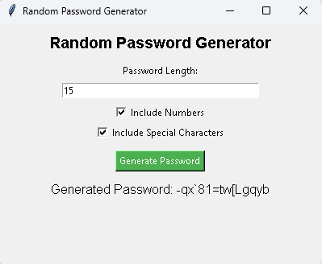

# Random Password Generator

A simple random password generator with a graphical user interface (GUI) built using Python and Tkinter. This tool generates secure and randomized passwords with customizable length and character options.

## Features

- Generate passwords with a mix of letters (uppercase and lowercase), numbers, and special characters.
- Customize password length and choose whether to include numbers and special characters.
- Ensures that at least one number and one special character are present in the generated password if selected.
- User-friendly GUI for easy interaction.

## Prerequisites

Make sure you have Python and the `tkinter` library installed in your environment. If you don't have `tkinter` installed, you can typically install it using the following command:

bash : `pip install tk`

## How to Run

-Clone this repository or download the `Random_Password_Generator.py` file.

-Open a terminal/command prompt and navigate to the project directory.

-Run the following command to start the Random Password Generator: `python Random_Password_Generator.py`

-The GUI window will open. Enter the desired password length, select the options to include numbers and special characters, then click the "Generate Password" button.

-The generated password will be displayed in the GUI.

## Screenshots

